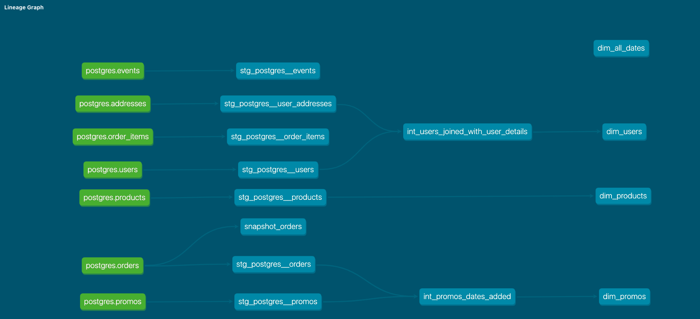

## Week 02 Homework

<br>

# Part 1. Models

We were approached by the marketing team to answer some questions about Greenery’s users! 
- Use your staging models you created in Week 1 to answer their questions:

<br>

### SECTION 01

What is our user repeat rate? **79.8% of users are repeat customers**
- Repeat Rate = Users who purchased 2 or more times / users who purchased

    ```sql
    -- cte
    with repeat_customers_flagged as (
        
        -- flag repeat customers
        select distinct
            user_guid
            , case when count(order_guid) over(partition by user_guid) > 1 then 1
                else 0
            end as repeat_customer
        from stg_postgres__orders
    )

    -- calculate metric
    select sum(repeat_customer) / count(user_guid) as repeat_rate
    from repeat_customers_flagged
    ```

<br>

### SECTION 02

What are good indicators of a user who will likely purchase again? 
- **repeat customers are probably more likely to purchase again**
**- big spenders, big baskets, email-subscribers, promo-shoppers**

What about indicators of users who are likely NOT to purchase again? 
- **days since last purchase is high**
- **did not sign up for emails, purchased as guest**
- **low spend, small baskets, promo-shoppers**

If you had more data, what features would you want to look into to answer this question?
- **email-subscriber list, guest-purchase flag**
- **platform they signed up on, gift-purchase flag, NPS scores**

<br>

### SECTION 03

More stakeholders are coming to us for data, which is great! But we need to get some more models created before we can help. 

Explain the marts models you added. Why did you organize the models in the way you did?

- **I mainly focused on setting up Dimensional tables for each area of the business (core/marketing/product). Learned a ton along the way and have a ways to go. Planning to add in a few fact tables this week**


Use the dbt docs to visualize your model DAGs to ensure the model layers make sense


<br>

### SECTION 05

Use the dbt docs to visualize your model DAGs to ensure the model layers make sense

Paste in an image of your DAG from the docs. These commands will help you see the full DAG
- dbt docs generate 
- dbt docs serve --no-browser



<br>

## Part 2. Tests

**DONE. Mainly added tests to the source/stage models for now.**
- played around with macros/tests e.g., macro = bad_zipcodes.sql

<br>

## Part 3. dbt Snapshots

Let's update our orders snapshot that we created last week to see how our data is changing:

1. Run the orders snapshot model using dbt snapshot and query it in snowflake to see how the data has changed since last week. 

    ```sql
    -- view orders that changed
    select * from snapshot_orders
    where dbt_valid_to is not null
    ```

2. Which orders changed from week 1 to week 2? 

    |changed_orders|
    |--------------|
    |914b8929-e04a-40f8-86ee-357f2be3a2a2|
    |05202733-0e17-4726-97c2-0520c024ab85|
    |939767ac-357a-4bec-91f8-a7b25edd46c9|